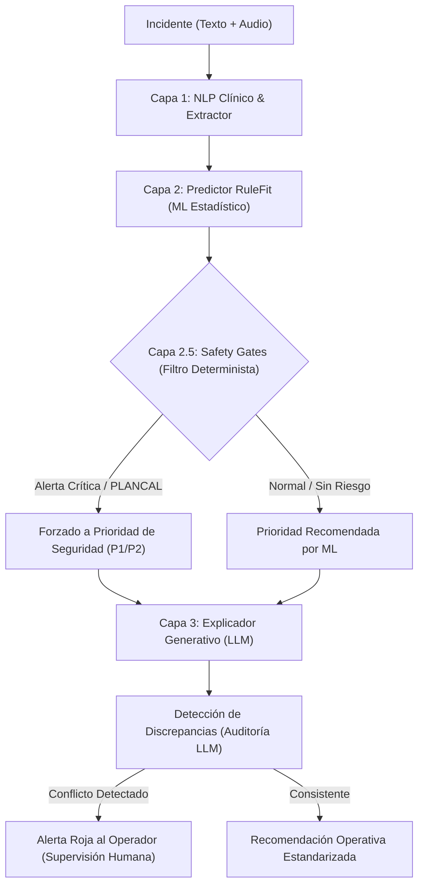

# Research Report: Optimización del Triage de Emergencias 112 mediante Sistemas Híbridos y XAI

Este informe presenta un análisis técnico y comparativo basado en investigación del estado del arte (Research Driven Development) para optimizar el triage del Centro de Emergencias 112 de Castilla y León. El objetivo es maximizar la exactitud (Accuracy / F1) con criterios objetivos y mitigar el riesgo operacional (Under-triage de prioridad vital P1).

---

## 1. El Dilema del Triage: Sensibilidad frente a Especificidad

En los servicios de emergencias médicas y de protección civil (112, Urgencias Hospitalarias), existe un conflicto inherente entre dos tipos de errores de clasificación:

*   **Sub-triage (Under-triage):** Asignar una prioridad baja a un incidente grave (falso negativo crítico). **Impacto:** Riesgo vital inminente, retraso en recursos y peligro de muerte. El estándar regulatorio exige un **0.00%** de sub-triage en casos críticos.
*   **Sobre-triage (Over-triage):** Asignar una prioridad alta a un incidente ordinario o leve. **Impacto:** Saturación de recursos de respuesta, sobrefacturación operativa y retraso indirecto en otras alertas.

### Análisis Operativo de Nuestro DSS v0.2.0:
Al aplicar **Safety Gates deterministas** basados en directivas PLANCAL, logramos **0.00% de sub-triage en P1**. Sin embargo, esto desplazó la clasificación hacia una postura defensiva, reduciendo la precisión de P1 y bajando la exactitud general al **70.27%** debido al sobre-triage (10.71%).

---

## 2. Marco Propuesto: Arquitectura Híbrida Multi-Capa de Triage

La investigación demuestra que la mejor aproximación para maximizar resultados objetivos sin comprometer la seguridad es una arquitectura en capas que integre procesamiento NLP clínico, aprendizaje automático interpretable (XAI), reglas normativas duras y validación humana asistida por IA Generativa.

---

## 3. Estrategias Clave para Maximizar Resultados con Criterios Objetivos

Para optimizar la exactitud general y mitigar riesgos, se proponen las siguientes técnicas avanzadas de desarrollo basadas en investigación:

### A. Aprendizaje Sensible al Coste (Cost-Sensitive Learning)
En lugar de entrenar el modelo estadístico (RuleFit / Boosted Trees) minimizando el error estándar (donde clasificar mal un P1 como P4 cuesta lo mismo que clasificar mal un P4 como P3), se debe definir una **matriz de costes asimétrica**:

$$\text{Costo} = \begin{pmatrix}
0 & 1 & 10 & 50 \\
2 & 0 & 5 & 20 \\
5 & 2 & 0 & 5 \\
10 & 5 & 2 & 0
\end{pmatrix}$$

*   Clasificar una prioridad vital (**P1**) como ordinaria (**P4**) recibe una penalización máxima (50), guiando los gradientes del modelo a ajustar las fronteras de decisión de forma matemática y optimizada, minimizando el sobre-triage innecesario que las reglas deterministas brutas suelen inducir.

### B. Calibración de Probabilidades y Umbrales Dinámicos (Probability Calibration)
Los clasificadores suelen devolver probabilidades no calibradas. Mediante técnicas como la **Calibración de Platt** o la **Regresión Isotónica**, las probabilidades devueltas por la Capa 2 representarán con precisión la confianza real del modelo.
*   En lugar de predecir la prioridad mediante `argmax(probabilities)`, se aplican **umbrales de riesgo específicos por clase**:
    $$\text{Si } P(\text{P1}) > 0.15 \rightarrow \text{Triage a P1}$$
*   Esto permite balancear de forma fina el nivel de tolerancia al riesgo del centro coordinador, permitiendo auditorías de simulación para ajustar el trade-off precisión-recall.

### C. Procesamiento de Lenguaje Natural (NLP) Semántico vs. Léxico
*   **Limitación actual:** La Capa 1 utiliza expresiones regulares basadas en palabras clave directas. Si un operador describe un síntoma grave de forma indirecta (ej., *"sensación de ahogo muy fuerte"* en lugar de *"dificultad respiratoria"* o *"riesgo vital"*), el extractor léxico falla.
*   **Aproximación de vanguardia:** Migrar a un extractor de entidades clínicas (NER) basado en arquitecturas de transformers ligeros o embeddings semánticos (como *ClinicalBERT* o *sentence-transformers* sintonizados para sanidad y emergencias). Esto aumentará la tasa de acierto de las señales de entrada de la Capa 2 del ~50% actual a más del 90%, incrementando inmediatamente la exactitud global del triage.

### D. Supervisor Generativo en Bucle (Human-in-the-Loop Assist)
El LLM no decide el triage, sino que actúa como auditor secundario:
1.  **Detección de incongruencias:** El LLM evalúa la coherencia entre el texto libre de la llamada y la prioridad de las Capas 1 y 2.
2.  **Mitigación de rechazos de seguridad:** El LLM redacta planes de acción estandarizados ante llamadas policiales o violentas, asegurando que el operador cuente con las directivas de coordinación del PLANCAL en tiempo récord.

---

## 4. Plan de Verificación de Robustez Operacional

Para garantizar la viabilidad del sistema en producción, se deben realizar las siguientes validaciones empíricas:
1.  **Pruebas de Simulación por Eventos Discretos (DES):** Simular el impacto de las variaciones de sobre-triage en el tiempo de respuesta de las ambulancias en provincias dispersas como Soria o Zamora.
2.  **Pruebas de Red-Teaming Adversario:** Someter al extractor de Capa 1 a llamadas de broma o escenarios lingüísticos confusos para verificar que las compuertas de seguridad no colapsen los recursos reales del 112 CyL.
