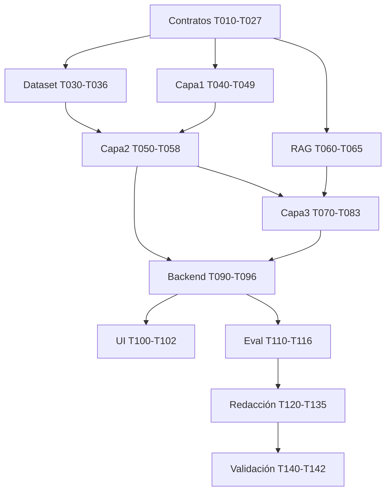

# Tasks — Priorización 112 CyL

**Feature**: `001-priorizacion-112-cyl` · **Generated**: 2026-05-24 · **Last update**: 2026-05-24 (R-13 scope simplification)
**Convención Spec Kit**:
- `T###` numeración correlativa.
- `[P]` = paralelizable (afecta ficheros distintos, sin dependencias con otras tareas en la misma oleada).
- Orden TDD: tests primero, luego implementación.
- Cada tarea referencia su artefacto fuente entre paréntesis.
- Asignación: `[A]` Ancor, `[J]` Juan Carlos, `[B]` Brian, `[C]` Conjunto.

> **Alcance v0.1.0** (R-13 en `research.md`): variables V01–V07, V12–V15 activas; V08–V11 (AEMET, INUNCYL/SNCZI, Seveso) diferidas. **3 tools MCP** (sin `get_aemet_context`). UI **Streamlit** única. Validación **interna** entre los 3 autores. Esto **reduce ~10 tareas** sin tocar el núcleo NLP + RuleFit + LLM ni la constitución.

---

## Fase 0 — Setup repositorio y constitución

- [x] **T001** `[C]` Crear estructura `src/`, `scripts/`, `tests/`, `artifacts/`, `resources/corpus_normativo/` según `plan.md` §Project Structure.
- [x] **T002** `[C]` Inicializar `pyproject.toml` raíz con `uv`/`hatch`, Python 3.11, lockfile reproducible.
- [x] **T003** `[C]` Configurar pre-commit: `ruff`, `black`, `mypy --strict` en `src/contracts/`, `pytest -q`.
- [x] **T004** `[C]` Configurar CI (GitHub Actions): tests + schema-diff + leakage-gate + coverage ≥80%.
- [x] **T005** `[C]` Crear `.specify/memory/amendments.log` vacío y `README.md` raíz con enlace a constitución.

## Fase 1 — Contratos (gate para todo lo demás)

- [ ] **T010** `[C]` Crear paquete `src/contracts/` con `pyproject.toml` instalable (`pip install -e ./src/contracts`).
- [ ] **T011 [P]** `[C]` `src/contracts/contracts/enums.py`: `Priority`, `ConfidenceLevel`, `ModelUsed`, `VariableSource`, `ProvinciaCyL`, `CategoriaPreliminar`, `NormaID`.
- [ ] **T012 [P]** `[C]` `src/contracts/contracts/incident_input.py` con tests `tests/test_incident_input.py` (validación lat/lon coherente, texto no vacío).
- [ ] **T013 [P]** `[C]` `src/contracts/contracts/incident_features.py` (E-02) con `BoolWithConfidence`, `IntWithConfidence`, V01–V15, signals. Tests roundtrip + ejemplo golden.
- [ ] **T014 [P]** `[C]` `src/contracts/contracts/priority_recommendation.py` (E-03) con `ActivatedRule`. Tests: sum probs == 1, argmax == recommended, ≤30 reglas si RULEFIT, P1/P2 requiere ≥1 regla.
- [ ] **T015 [P]** `[C]` `src/contracts/contracts/operator_recommendation.py` (E-04) con `LegalCitation`. Tests: P1/P2 requiere ≥1 cita, explanation 20–1200 chars, temp 0.0 en producción.
- [ ] **T016 [P]** `[C]` `src/contracts/contracts/rule.py` (E-06) y `weak_label.py` (E-07).
- [ ] **T017 [P]** `[C]` `src/contracts/contracts/inference_log.py` (E-08) con hash SHA-256 input.
- [ ] **T018 [P]** `[C]` `src/contracts/contracts/errors.py`: `LeakageFieldRejectedError`, `LowConfidenceWarning`, `SLABreachWarning`, etc.
- [ ] **T019** `[C]` Script `scripts/export_schemas.py` que dump JSON Schema de cada modelo a `src/contracts/docs/schemas/`.
- [ ] **T020** `[C]` Test CI `tests/test_schema_diff.py` que compara schemas commiteados con regenerados y falla si difieren sin bump de versión.
- [ ] **T021** `[C]` Test CI `tests/test_leakage_gate.py` que escanea `src/capa1_nlp/` y `src/capa2_rulefit/` por referencias a columnas prohibidas (Principio V).
- [ ] **T022 [P]** `[C]` ADR `src/contracts/docs/adr/0001-pydantic-as-contract.md`.
- [ ] **T023 [P]** `[C]` ADR `0002-priority-scale-p1-p4-is-academic.md`.
- [ ] **T024 [P]** `[C]` ADR `0003-versioning-strategy.md` (semver + schema diff CI).
- [ ] **T025 [P]** `[C]` ADR `0004-no-leakage-policy.md`.
- [ ] **T026 [P]** `[C]` ADR `0005-mcp-as-capa3-interface.md`.
- [ ] **T027 [P]** `[C]` Factories en `src/contracts/tests/factories.py` con `polyfactory` para todos los modelos.

## Fase 2 — Dataset + weak supervision (Juan Carlos)

- [ ] **T030** `[J]` Auditar dataset limpio `resources/dataset/processed/emergencias_112_cyl_2008_2022_clean.csv` y documentar nulos, duplicados, distribución por año/provincia.
- [ ] **T031** `[J]` Definir guía de etiquetado P1–P4 anclada en PLANCAL (Decreto 4/2019). Guardar en `latex/chapters/anexo_c.tex` y `resources/labeling_guide_p1p4.md`.
- [ ] **T032** `[J]` Implementar `scripts/build_weak_labels.py`:
  - 4 anotadores independientes según R-03 (LLM-as-annotator, NER+intensificadores, clustering, reglas heurísticas con peso mínimo).
  - Label model con majority voting ponderado.
  - Output: `resources/dataset/processed/weak_labels_p1p4.parquet` + métrica Krippendorff α global y por anotador.
- [ ] **T033** `[J]` Test: α global ≥ 0,67 (umbral aceptable).
- [ ] **T034 [P]** `[J]` Implementar splits estratificados (año + provincia + label) en `scripts/build_splits.py`. Output: `resources/dataset/splits/{train,val,test}.parquet`.
- [ ] **T035 [P]** `[J]` Implementar split temporal alternativo (≤2020 train, 2021–22 test) en mismo script con flag `--temporal`.
- [ ] **T036** `[J]` Ablación anti-circularidad: entrenar label model **sin** la fuente "reglas heurísticas" y comparar distribución. Documentar en `research.md` apéndice.

## Fase 3 — Capa 1 NLP (Ancor)

- [ ] **T040** `[A]` Crear `src/capa1_nlp/` con módulos `extraction/`, `training/`, `inference/`, `tests/`.
- [ ] **T041 [P]** `[A]` Test contrato: dado un texto golden, `extract_features()` devuelve `IncidentFeatures` válido (Pydantic).
- [ ] **T042 [P]** `[A]` Test latencia: extracción ≤ 500 ms p95 sobre 100 textos del test set.
- [ ] **T043 [P]** `[A]` Test anti-leakage: el extractor no consume ninguna columna prohibida (lista del Principio V).
- [ ] **T044** `[A]` Implementar extractor determinista de `signals` (regex + diccionarios léxicos) en `extraction/signal_extractor.py`.
- [ ] **T045** `[A]` Dataset HuggingFace para fine-tune NER + multi-label V01–V15 desde weak labels + anotaciones manuales mínimas (~200 ejemplos gold por variable crítica).
- [ ] **T046** `[A]` `scripts/train_capa1.py`: fine-tune `roberta-base-bne` con cabeza multitarea. Persistir en `artifacts/models/capa1/v0.1.0/`.
- [ ] **T047** `[A]` Wrapper de inferencia `inference/feature_extractor.py` que combina señales deterministas + transformer y produce `IncidentFeatures`.
- [ ] **T048** `[A]` Reporte de métricas Capa 1: macro-F1 NER, F1 por variable V01–V15, latencia. Guardar en `artifacts/reports/capa1_v0.1.0.json`.
- [ ] **T049** `[A]` Model card Capa 1 → `latex/chapters/anexo_l.tex` (sección transformer).

## Fase 4 — Capa 2 RuleFit + baseline + ceiling (Juan Carlos)

- [ ] **T050** `[J]` Crear `src/capa2_rulefit/` con `weak_supervision/`, `baseline_expert/`, `rulefit/`, `xgboost_ceiling/`, `inference/`, `tests/`.
- [ ] **T051 [P]** `[J]` Test contrato: dado `IncidentFeatures` válido, `predict()` devuelve `PriorityRecommendation` válido.
- [ ] **T052 [P]** `[J]` Test invariantes: sum probs == 1, argmax == recommended, ≤30 reglas, P1 con ≥1 regla.
- [ ] **T053** `[J]` Implementar `baseline_expert/expert_rules.py`: ~15 reglas a batir, basadas en señales + V01..V15, con anclaje normativo en cada regla.
- [ ] **T054** `[J]` `scripts/train_capa2.py` RuleFit:
  - `imodels.RuleFitClassifier(max_rules=80, alpha=...)` con LASSO sparsity hasta ≤30 reglas activas.
  - Calibración isotonic en validación.
  - Persistir en `artifacts/models/capa2/v0.1.0/rulefit.joblib` + `rules.json`.
- [ ] **T055 [P]** `[J]` `scripts/train_xgboost_ceiling.py`: techo opaco con XGBoost + SHAP. Persistir en `artifacts/models/capa2/v0.1.0/xgb_ceiling.joblib`. **Marcar como no productivo** (banner en logs).
- [ ] **T056** `[J]` Wrapper `inference/predictor.py` que selecciona RuleFit / baseline / fallback según disponibilidad.
- [ ] **T057** `[J]` Reporte de métricas Capa 2: F1 macro/por clase, recall@P1 (≥0,85), ECE (≤0,10), sparsity, AUC. Comparativa baseline vs RuleFit vs XGBoost. `artifacts/reports/capa2_v0.1.0.json`.
- [ ] **T058** `[J]` Model card RuleFit + tabla de reglas activadas → `anexo_e.tex` (baseline experto) + `anexo_l.tex` (model card RuleFit).

## Fase 5 — Corpus normativo + RAG (Brian)

- [ ] **T060** `[B]` Recopilar PDFs/HTML oficiales de las 15 normas en `resources/corpus_normativo/` (BOE/BOCYL links).
- [ ] **T061** `[B]` Pipeline ingesta: parser PDF → chunking (~400 tokens, overlap 50) → metadata `{norma_id, articulo, año, jerarquía}`.
- [ ] **T062** `[B]` `scripts/build_rag_index.py` con embeddings `paraphrase-multilingual-MiniLM-L12-v2` → ChromaDB persistente en `artifacts/rag/chroma/`.
- [ ] **T063** `[B]` Test retrieval: query "atrapado herido grave" → top-1 cita Ley 17/2015 art. 1.
- [ ] **T064** `[B]` Test retrieval: query "fuga química camión cisterna" → top-1 cita MPCyL.
- [ ] **T065** `[B]` Documentar corpus en `latex/chapters/anexo_j.tex`.

## Fase 6 — Capa 3 LLM + MCP (Brian)

- [ ] **T070** `[B]` Crear `src/capa3_llm_mcp/` con `rag/`, `llm/`, `prompts/`, `mcp_server/`, `tests/`.
- [ ] **T071 [P]** `[B]` Test contrato: dado `PriorityRecommendation`, `explain()` devuelve `OperatorRecommendation` válido.
- [ ] **T072 [P]** `[B]` Test latencia: explicación ≤ 2 000 ms p95.
- [ ] **T073** `[B]` Wrapper LLM `llm/qwen_wrapper.py` con `llama-cpp-python`, modelo `qwen2.5-7b-instruct-q4_k_m.gguf` en `artifacts/llm/`. Temperature 0.0.
- [ ] **T074** `[B]` Prompts en `prompts/`: system prompt + few-shot (3 ejemplos: P1, P3, P4). Documentar en `anexo_k.tex`.
- [ ] **T075 [P]** `[B]` Tool `mcp_server/tools/search_normative.py`.
- [ ] **T076 [P]** `[B]` Tool `mcp_server/tools/get_rule_details.py`.
- [ ] **~~T077~~** `[B]` ~~Tool `mcp_server/tools/get_aemet_context.py`~~ — **DIFERIDA v0.2.0 (R-13)**.
- [ ] **T078 [P]** `[B]` Tool `mcp_server/tools/cite_legal_basis.py`.
- [ ] **T079** `[B]` Servidor MCP `mcp_server/server.py` con las **3 tools v0.1.0** (`search_normative`, `get_rule_details`, `cite_legal_basis`) registradas, escucha en `localhost:8765`. `get_aemet_context` reservada en contrato v0.2.0.
- [ ] **T080** `[B]` Test integración MCP: cliente test invoca cada tool y valida schema.
- [ ] **T081** `[B]` Wrapper `explainer.py` que orquesta LLM + tools + RAG y produce `OperatorRecommendation`.
- [ ] **T082** `[B]` Modo degradado: si LLM no disponible, devolver explicación estática derivada de reglas activadas (Header `X-Degraded-Mode`).
- [ ] **T083** `[B]` Model card LLM + prompts → `anexo_l.tex` (sección LLM) y `anexo_k.tex`.

## Fase 7 — Backend + orquestador (Conjunto, líder Brian)

- [ ] **T090** `[B]` `src/backend/api/` FastAPI con endpoints `/predict`, `/feedback`, `/healthz`, `/version`.
- [ ] **T091** `[B]` `src/backend/orchestrator/pipeline.py` que encadena Capa 1 → 2 → 3 con timeouts y fallback degradado.
- [ ] **T092** `[B]` `src/backend/logging/` con SQLite + JSONL rotado, persiste `InferenceLog`.
- [ ] **T093** `[C]` Test integración endpoint `/predict` con Escenario 1 de quickstart.
- [ ] **T094** `[C]` Test integración endpoint `/feedback` con Escenario 4.
- [ ] **T095** `[C]` Test rechazo leakage Escenario 5.
- [ ] **T096** `[C]` Test modo degradado Escenario 6.

## Fase 8 — UI mínima Streamlit (Conjunto, Q-01 cerrada)

- [x] **T100** `[C]` Decisión Q-01 cerrada: **Streamlit** (R-13). Sin alternativa React en v0.1.0.
- [ ] **T101** `[C]` Implementar UI Streamlit `src/ui/app.py`: formulario incidente + visualización recomendación + reglas activadas + explicación + acción aceptar/modificar/rechazar.
- [ ] **T102** `[C]` Capturas para `anexo_g.tex`.

## Fase 9 — Evaluación (Conjunto, líder Juan Carlos para ML; Brian para LLM)

- [ ] **T110** `[J]` `scripts/run_evaluation.py` produce todas las métricas obligatorias de Cap. 9 sobre test set y test temporal.
- [ ] **T111** `[J]` Análisis de sesgo por provincia, año y categoría → tablas + figuras.
- [ ] **T112** `[J]` Matriz de confusión + análisis de errores en P1 (falsos negativos críticos).
- [ ] **T113** `[B]` Evaluación fidelidad explicaciones con **LLM-as-Judge** (Zheng et al., 2023): juez independiente puntúa coherencia explicación↔reglas sobre ≥100 casos.
- [ ] **T114** `[C]` Validación interna entre los 3 autores sobre ≥30 casos (Q-02 cerrada, R-13): cada autor etiqueta de forma independiente, se calcula α inter-anotador local y se documenta divergencia con el sistema. Plantilla en `anexo_d.tex`. **Validación externa con personal del 112** queda como trabajo futuro documentado en Cap. 10.
- [ ] **T115** `[C]` Conformidad UE-IA: checklist Anexo III evaluada → `anexo_m.tex` (trazabilidad extendida).
- [ ] **T116** `[C]` Reporte final evaluación → `artifacts/reports/evaluation_v0.1.0.json` y `latex/chapters/chap9.tex`.

## Fase 10 — Redacción capítulos (LaTeX Scribe + autores)

- [ ] **T120 [P]** `[C]` Actualizar `chap0.tex` (reparto + métricas individuales).
- [ ] **T121 [P]** `[C]` Reescribir `chap1.tex` (Aragón → CyL + frase-espina).
- [ ] **T122 [P]** `[C]` Ampliar `chap2.tex` con nuevas secciones estado-arte (RuleFit, weak supervision, LLM locales, MCP, Reg. UE IA, ello incluye fix de `(?,?)` págs 19–22).
- [ ] **T123** `[C]` Reescribir `chap3.tex` completo con marco normativo CyL + tabla de trazabilidad.
- [ ] **T124 [P]** `[C]` Reformular `chap4.tex` con OG + OE1–OE4.
- [ ] **T125 [P]** `[C]` Actualizar `chap5.tex` con RF/RNF nuevos.
- [ ] **T126** `[C]` Reescribir `chap6.tex` (3 capas reales).
- [ ] **T127** `[J]` Reescribir `chap7.tex` (CyL + weak supervision + sección anti-leakage).
- [ ] **T128** `[C]` Escribir `chap8.tex` (prototipo: contratos, módulos, MCP, despliegue).
- [ ] **T129** `[C]` Escribir `chap9.tex` (evaluación con resultados reales).
- [ ] **T130** `[C]` Escribir `chap10.tex` (conclusiones + trabajo futuro).
- [ ] **T131 [P]** `[C]` Actualizar `anexo_a.tex` (taxonomía CyL), `anexo_b.tex` (variables V01–V15), `anexo_c.tex` (guía P1–P4), `anexo_d.tex` (plantilla + 20 casos), `anexo_e.tex` (baseline experto), `anexo_f.tex` (esquema datos).
- [ ] **T132 [P]** `[C]` Crear anexos nuevos: `anexo_g.tex` (capturas), `anexo_h.tex` (uso IA), `anexo_i.tex` (contratos Pydantic), `anexo_j.tex` (corpus RAG), `anexo_k.tex` (prompts+tools), `anexo_l.tex` (model cards), `anexo_m.tex` (trazabilidad extendida).
- [ ] **T133** `[C]` Pase de coherencia cross-chapter por LaTeX Scribe.
- [ ] **T134** `[C]` Bibliografía: añadir 2023–26 (RuleFit, Snorkel, MarIA, LLM-as-Judge, MCP, Reg. UE IA Anexo III) + 15 normas CyL → `bibliografia.bib`.
- [ ] **T135** `[C]` Compilación final `latexmk -pdf -outdir=build latex/main.tex` sin warnings críticos.

## Fase 11 — Validación final

- [ ] **T140** `[C]` Ejecutar `quickstart.md` completo → 6/6 escenarios verdes.
- [ ] **T141** `[C]` Verificar checklist constitucional final.
- [ ] **T142** `[C]` Ensayo de defensa con tribunal simulado.

---

## Dependencias críticas

## Resumen reparto

| Persona | Tareas principales | N |
|---|---|---|
| Ancor `[A]` | T040–T049 (Capa 1 NLP) | 10 |
| Juan Carlos `[J]` | T030–T036, T050–T058, T110–T112, T127 | 18 |
| Brian `[B]` | T060–T065, T070–T083, T090–T092, T113 | 22 |
| Conjunto `[C]` | T001–T027, T093–T102, T114–T116, T120–T142 | 50 |
| **Total** | | **~100** |
